Euro 2021 Player Stats Analysis
================
Written by Lucas Okwudishu on 06/18/2021

## **Introduction**

While watching a particular game in the ongoing Euro 2021 competition, a
discussion between commentators about the average age of a particular
team really got me curious. I immediately began to wonder what the age
distribution of players on teams at the competition was like. I decided
to go online and search for data on player ages, which in-turn led to an
entire data analysis project.

In this project, I’ll be analyzing data such as age, number of caps,
number of goals, etc for teams at the Euro 2021 competition.

## **Scraping The Data**

I decided to try something new this time by web scraping the data, as
opposed to just downloading a ready made dataset. This was my first time
trying web scraping so I’m not able to give detailed explanations on the
web scraping process. However 2 helpful resources that do just that are
the [UC Business Analytics R Programming
Guide](http://uc-r.github.io/scraping) and
[Dataslice](https://www.youtube.com/watch?v=v8Yh_4oE-Fs).

To scrape the data, I made use of 2 popular **`R`** libraries,
**`tidyverse`** and **`rvest`**.

``` r
# Load libraries
library(tidyverse)
library(rvest)
library(patchwork)
```

------------------------------------------------------------------------

Next I scraped
[wikipedia](https://en.wikipedia.org/wiki/UEFA_Euro_2020_squads) to get
data about participating countries using the following steps:

-   Step 1: Scrape the webpage for participating countries

-   Step 2: Scrape the webpage names of team coaches

-   Step 3: Scrape the webpage for data tables for all 24 participating
    countries. Tables included data on player names, positions (goal
    keepers, defenders, etc.), number of international caps, number of
    international goals, and players current club.

-   Step 4: Clean! Clean!! Clean!!! Clean, format and merge datasets

### **Step 1: Scrape List of Participating Countries**

Using functions from the **`rvest`** library, I extracted a list of
**h3** headers from the web page, then filtered for the first 24 **h3**
headers which were the names of participating countries.

``` r
# Wikipedia page url
url <- "https://en.wikipedia.org/wiki/UEFA_Euro_2020_squads"

# Covert url into html object
page <- read_html(url)

# Extract list of participating countries
countries_list <- page %>% 
  html_nodes("h3") %>% 
  html_text()

countries_list <- countries_list[1:24]
countries_list
```

    ##  [1] "Italy"           "Switzerland"     "Turkey"          "Wales"          
    ##  [5] "Belgium"         "Denmark"         "Finland"         "Russia"         
    ##  [9] "Austria"         "Netherlands"     "North Macedonia" "Ukraine"        
    ## [13] "Croatia"         "Czech Republic"  "England"         "Scotland"       
    ## [17] "Poland"          "Slovakia"        "Spain"           "Sweden"         
    ## [21] "France"          "Germany"         "Hungary"         "Portugal"

------------------------------------------------------------------------

### **Step 2: Scrape Names of Team Coaches**

On the web page, a new paragraph starts right after the **h3** headers.
Some of these paragraphs (html tag “p”) included the names of team
coaches.

I extracted all paragraphs on the webpage, added them to a dataframe,
filtered for all rows that included the string “Manager”, then finally
removed the string “Manager:” using **`stringr`**, thus leaving only the
name ofs of the coaches.

``` r
# Get names of coaches
coach_names <- page %>% 
  html_nodes("p") %>% 
  html_text() %>% 
  str_split("\n") %>% 
  unlist() %>% 
  tibble() %>% 
  rename(coach = ".") %>% 
  filter(grepl("Manager", coach)) %>% 
  mutate(coach = coach %>% str_remove_all("Manager: "),
         coach = coach %>% str_trim(side = "both"))

coach_names %>% head()
```

    ## # A tibble: 6 x 1
    ##   coach            
    ##   <chr>            
    ## 1 Roberto Mancini  
    ## 2 Vladimir Petković
    ## 3 Şenol Güneş      
    ## 4 Rob Page         
    ## 5 Roberto Martínez 
    ## 6 Kasper Hjulmand

------------------------------------------------------------------------

### **Step 3: Scrape Data Tables for Participating Countries**

On the webpage, there are 24 data tables which I scraped next. I did so
by first extracting the html tag “table”, then once again filtering for
the first 24 tables into a list. I show the code below and display the
first table in the list.

``` r
# Get data tables
table_list <- html_nodes(page, "table")

table_list <- table_list %>% 
  .[1:24] %>% 
  html_table(fill = TRUE)

table_list[[1]] %>% glimpse()
```

    ## Rows: 26
    ## Columns: 7
    ## $ No.                   <int> 1, 2, 3, 4, 5, 6, 7, 8, 9, 10, 11, 12, 13, 14, 1…
    ## $ Pos.                  <chr> "1GK", "2DF", "2DF", "2DF", "3MF", "3MF", "3MF",…
    ## $ Player                <chr> "Salvatore Sirigu", "Giovanni Di Lorenzo", "Gior…
    ## $ `Date of birth (age)` <chr> "(1987-01-12)12 January 1987 (aged 34)", "(1993-…
    ## $ Caps                  <int> 26, 7, 107, 14, 10, 40, 2, 28, 33, 41, 11, 5, 15…
    ## $ Goals                 <int> 0, 0, 8, 0, 1, 3, 0, 5, 12, 8, 5, 2, 0, 1, 1, 1,…
    ## $ Club                  <chr> "Torino", "Napoli", "Juventus", "Roma", "Sassuol…

------------------------------------------------------------------------

### **Step 4: Clean! Clean!! Clean!!!**

The first thing I did here was to create a dataframe of the countries
and coaches:

``` r
# Dataframe of country & coach
country_coach_tbl <- tibble(country = countries_list) %>% 
  bind_cols(coach_names)

country_coach_tbl %>% head()
```

    ## # A tibble: 6 x 2
    ##   country     coach            
    ##   <chr>       <chr>            
    ## 1 Italy       Roberto Mancini  
    ## 2 Switzerland Vladimir Petković
    ## 3 Turkey      Şenol Güneş      
    ## 4 Wales       Rob Page         
    ## 5 Belgium     Roberto Martínez 
    ## 6 Denmark     Kasper Hjulmand

------------------------------------------------------------------------

The second thing I did here was create a custom function to merge the
country and coach columns from above to the corresponding data table for
that country. Next I applied that function each of the 24 data tables,
while also during a **`rbind`** to merge all 24 tables:

``` r
# Custom function to merge data table with corresponding country and coach
func_add_country_coach <- function(table_list_no = 1, coach_country_no = 1){
  
  table_list[[table_list_no]] %>% 
    mutate(country  = country_coach_tbl[coach_country_no,]$country,
           coach    = country_coach_tbl[coach_country_no,]$coach)
}

# Apply custom function from above to all 24 tables while binding rows
euros_tbl <- tibble(
  rbind(
  func_add_country_coach(1, 1), func_add_country_coach(2, 2),
  func_add_country_coach(3, 3), func_add_country_coach(4, 4),
  func_add_country_coach(5, 5), func_add_country_coach(6, 6),
  func_add_country_coach(7, 7), func_add_country_coach(8, 8),
  func_add_country_coach(9, 9), func_add_country_coach(10, 10),
  func_add_country_coach(11, 11), func_add_country_coach(12, 12),
  func_add_country_coach(13, 13), func_add_country_coach(14, 14),
  func_add_country_coach(15, 15), func_add_country_coach(16, 16),
  func_add_country_coach(17, 17), func_add_country_coach(18, 18),
  func_add_country_coach(19, 19), func_add_country_coach(20, 20),
  func_add_country_coach(21, 21), func_add_country_coach(22, 22),
  func_add_country_coach(23, 23), func_add_country_coach(24, 24)
  
  )
)

euros_tbl %>% glimpse()
```

    ## Rows: 623
    ## Columns: 9
    ## $ No.                   <int> 1, 2, 3, 4, 5, 6, 7, 8, 9, 10, 11, 12, 13, 14, 1…
    ## $ Pos.                  <chr> "1GK", "2DF", "2DF", "2DF", "3MF", "3MF", "3MF",…
    ## $ Player                <chr> "Salvatore Sirigu", "Giovanni Di Lorenzo", "Gior…
    ## $ `Date of birth (age)` <chr> "(1987-01-12)12 January 1987 (aged 34)", "(1993-…
    ## $ Caps                  <int> 26, 7, 107, 14, 10, 40, 2, 28, 33, 41, 11, 5, 15…
    ## $ Goals                 <int> 0, 0, 8, 0, 1, 3, 0, 5, 12, 8, 5, 2, 0, 1, 1, 1,…
    ## $ Club                  <chr> "Torino", "Napoli", "Juventus", "Roma", "Sassuol…
    ## $ country               <chr> "Italy", "Italy", "Italy", "Italy", "Italy", "It…
    ## $ coach                 <chr> "Roberto Mancini", "Roberto Mancini", "Roberto M…

------------------------------------------------------------------------

Finally I did some additional cleaning/formatting including extracting
the players age, adding a column to indicate the players position, and
add a column to indicate if a player is the team captain or not:

``` r
remove <- c("captain|\\(|\\)")

# Extract age
final_euros_tbl <- euros_tbl %>% 
    setNames(names(.) %>% str_to_lower()) %>% 
    rename(dob = `date of birth (age)`) %>% 
    separate(col = dob, into = c("col1", "col2", "col3", "col4", "col5"), sep = " ") %>% 
    select(-c("col1", "col2", "col3", "col4")) %>% 
    rename(age = col5) %>% 
    mutate(age = age %>% str_remove_all("\\)") %>% as.numeric) %>% 
    
    # Add position column
    mutate(position = case_when(
    str_detect(pos., "GK") ~ "Goalkeepers",
    str_detect(pos., "DF") ~ "Defenders",
    str_detect(pos., "MF") ~ "Midfielders",
    str_detect(pos., "FW") ~ "Forwards",
    )) %>% 
    mutate(position = position %>% fct_relevel("Goalkeepers", "Defenders", "Midfielders", "Forwards")) %>% 
    
    # Add captain indicator column
    mutate(captain = case_when(
        str_detect(player, "(captain)") ~ "Yes",
        TRUE ~ "No"
    )) %>% 
    
    # Remove the string "(captain)" from the "player" column
    mutate(player = player %>% str_remove_all(remove)) %>% 
    mutate(player_country = str_glue("{player} ({country})"))

final_euros_tbl %>% glimpse()
```

    ## Rows: 623
    ## Columns: 12
    ## $ no.            <int> 1, 2, 3, 4, 5, 6, 7, 8, 9, 10, 11, 12, 13, 14, 15, 16, …
    ## $ pos.           <chr> "1GK", "2DF", "2DF", "2DF", "3MF", "3MF", "3MF", "3MF",…
    ## $ player         <chr> "Salvatore Sirigu", "Giovanni Di Lorenzo", "Giorgio Chi…
    ## $ age            <dbl> 34, 27, 36, 28, 23, 28, 24, 29, 27, 30, 26, 24, 26, 23,…
    ## $ caps           <int> 26, 7, 107, 14, 10, 40, 2, 28, 33, 41, 11, 5, 15, 25, 1…
    ## $ goals          <int> 0, 0, 8, 0, 1, 3, 0, 5, 12, 8, 5, 2, 0, 1, 1, 1, 13, 5,…
    ## $ club           <chr> "Torino", "Napoli", "Juventus", "Roma", "Sassuolo", "Pa…
    ## $ country        <chr> "Italy", "Italy", "Italy", "Italy", "Italy", "Italy", "…
    ## $ coach          <chr> "Roberto Mancini", "Roberto Mancini", "Roberto Mancini"…
    ## $ position       <fct> Goalkeepers, Defenders, Defenders, Defenders, Midfielde…
    ## $ captain        <chr> "No", "No", "Yes", "No", "No", "No", "No", "No", "No", …
    ## $ player_country <glue> "Salvatore Sirigu (Italy)", "Giovanni Di Lorenzo (Ital…

------------------------------------------------------------------------

At this stage, I’m done with all the cleaning and formatting and have a
clean dataset to analyze. Before I proceed to any analysis, I checked to
see if there were any NA values.

``` r
# Check For NAs
final_euros_tbl %>% 
    sapply(function(x) sum(is.na(x)))
```

    ##            no.           pos.         player            age           caps 
    ##              0              0              0              0              0 
    ##          goals           club        country          coach       position 
    ##              0              0              0              0              0 
    ##        captain player_country 
    ##              0              0

Great! No NA values.

------------------------------------------------------------------------

## **Analyzing The Data**

I had several questions I was curious about such as:

-   What player has the most caps for he’s country?

-   What player has the most goals for he’s country?

-   Who are the youngest/oldest players in the tournament?

-   What is the age distribution ob players in the tournament?

I then proceeded to get the answers to these questions from the data and
visualize using barcharts.

### **What player(s) have the most caps for their country?**

``` r
# Function to create bar charts
func_plot_bar_chart <- function(data, x_var, y_var, label_var){
    
    x_var_expr <- rlang::enquo(x_var)
    y_var_expr <- rlang::enquo(y_var)
    label_var_expr <- rlang::enquo(label_var)
    
    data %>% 
    ggplot(aes(!!x_var_expr, !!y_var_expr))+
    geom_col(fill = "#669cd1", width = 0.7)+
    geom_text(aes(label = !!label_var_expr), hjust = 1, size = 3.5)+
    theme_minimal()+
    theme(axis.text.x = element_text(size = 10, colour = "black"),
                   axis.text.y = element_text(size = 10, color = "black"))
}

# Top 10 capped players
final_euros_tbl %>% 
    arrange(desc(caps)) %>% 
    slice_max(order_by = caps, n = 10) %>% 
    mutate(player_country = player_country %>% fct_reorder(caps)) %>% 
    func_plot_bar_chart(x_var = caps, y_var = player_country, label_var = caps)+
    labs(title = "Top 10 Capped Players", y = "", x = "\nNo. of Caps")
```

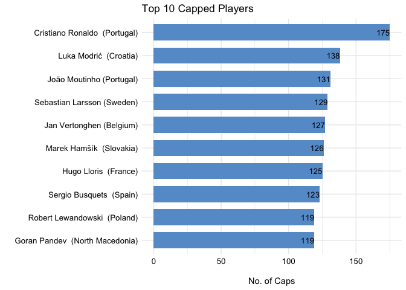<!-- -->

------------------------------------------------------------------------

### **Who are the highest capped players under 30?**

``` r
# Top 10 capped players under 30
final_euros_tbl %>% 
    filter(age < 30) %>% 
    arrange(desc(caps)) %>% 
    slice_max(order_by = caps, n = 10) %>% 
    mutate(player_country = player_country %>% fct_reorder(caps)) %>% 
    func_plot_bar_chart(x_var = caps, y_var = player_country, label_var = caps)+
    labs(title = "Top 10 Capped Players Under 30", y = "", x = "\nNo. of Caps")
```

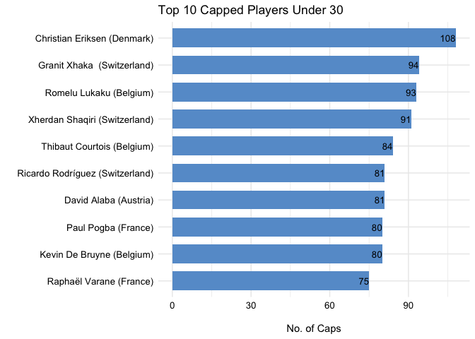<!-- -->

------------------------------------------------------------------------

### **Who are the highest capped players under 25?**

``` r
final_euros_tbl %>% 
    filter(age < 25) %>% 
    arrange(desc(caps)) %>% 
    slice_max(order_by = caps, n = 10) %>% 
    mutate(player_country = player_country %>% fct_reorder(caps)) %>% 
    func_plot_bar_chart(x_var = caps, y_var = player_country, label_var = caps)+
    labs(title = "Top 10 Capped Players Under 25", y = "", x = "\nNo. of Caps")
```

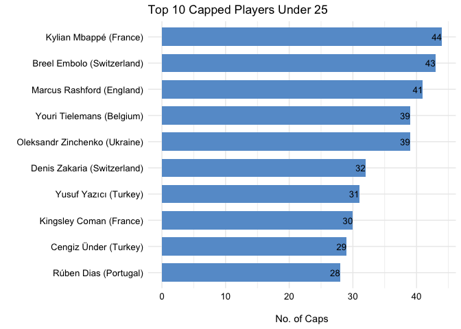<!-- -->

------------------------------------------------------------------------

### **What player(s) have the most goals for their country?**

``` r
# Top 10 goal scorers
final_euros_tbl %>% 
    arrange(desc(goals)) %>% 
    slice_max(order_by = goals, n = 10) %>% 
    mutate(player_country = player_country %>% fct_reorder(goals)) %>% 
    func_plot_bar_chart(x_var = goals, y_var = player_country, label_var = goals)+
    labs(title = "Top 10 Goal Scorers", y = "", x = "\nNo. of Goals")
```

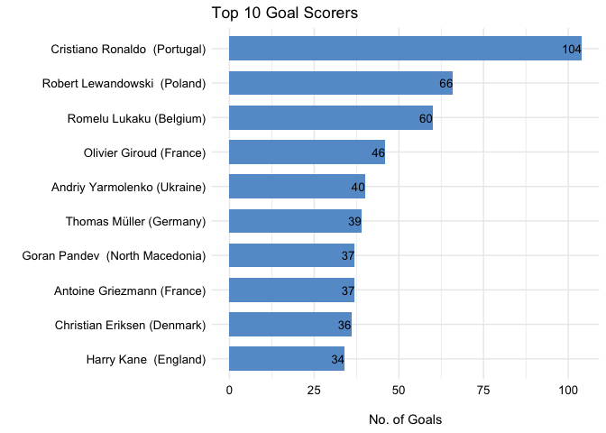<!-- -->

Understandably, players (forwards especially) who have a high number of
caps will also have a higher number of international goals than players
who may just be early or mid-way through their international careers.
Thus I wanted to look at the ratio of goals to caps for players with at
least 5 international caps, 10 international caps, 50 international
caps, and 100 international caps.

``` r
# Add caps bin to dataset 
goals_caps_tbl <- final_euros_tbl%>% 
    mutate(caps_bin = case_when(
        caps >= 5  & caps <= 10  ~ "5 - 10 caps",
        caps >= 10 & caps <= 50  ~ "11 - 50 caps",
        caps >= 50 & caps <= 100 ~ "51 - 100 caps",
        caps >= 100 ~ "Above 100 caps",
        TRUE ~ "Exclude")) %>% 
    mutate(caps_bin = caps_bin %>% fct_relevel("5 - 10 caps", "11 - 50 caps",
                                               "51 - 100 caps", "Above 100 caps",
                                               "Exclude")) %>% 
    filter(caps_bin != "Exclude") %>% 
    mutate(goal_to_cap_ratio = goals / caps) %>% 
    mutate(label_text = str_glue("{goals} | {caps} | {goal_to_cap_ratio %>% scales::percent(accuracy = 1)}"))

# Function to plot goals to caps ratio
func_plot_goal_cap_ratio <- function(data){
    
    data %>% 
        mutate(goal_to_cap_ratio = goals / caps) %>%
        arrange(desc(goal_to_cap_ratio)) %>% 
        mutate(player_country = player_country %>% fct_reorder(goal_to_cap_ratio)) %>% 
        slice_max(order_by = goal_to_cap_ratio, n = 10) 
}

# Goals to caps plot: 5 - 10 caps
goals_caps_tbl %>% 
    filter(caps_bin == "5 - 10 caps") %>% 
    func_plot_goal_cap_ratio() %>% 
    func_plot_bar_chart(x_var = goal_to_cap_ratio, y_var = player_country, label_var = label_text)+
    scale_x_continuous(labels = scales::percent_format(accuracy = 1))+
    labs(title = "Top 10 Players: Goals to Caps Ratio (5 - 10 Caps)", subtitle = "Goals | Caps | Ratio",
         x = "\nGoals to Caps Ratio", y = "")
```

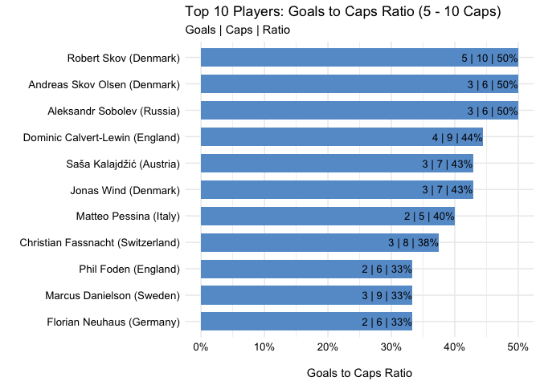<!-- -->

``` r
# Goals to caps plot: 10 - 50 caps
goals_caps_tbl %>% 
    filter(caps_bin == "11 - 50 caps") %>% 
    func_plot_goal_cap_ratio() %>% 
    func_plot_bar_chart(x_var = goal_to_cap_ratio, y_var = player_country, label_var = label_text)+
    scale_x_continuous(labels = scales::percent_format(accuracy = 1))+
    labs(title = "Top 10 Players: Goals to Caps Ratio (11 - 50 Caps)", subtitle = "Goals | Caps | Ratio",
         x = "\nGoals to Caps Ratio", y = "")
```

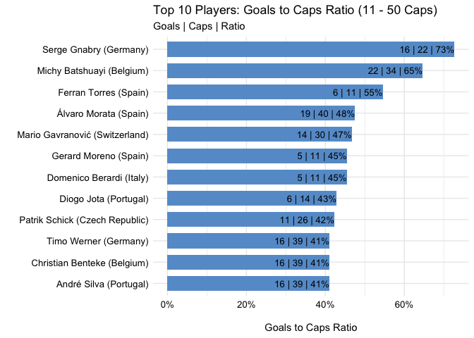<!-- -->

``` r
# Goals to caps plot: 50 - 100 caps
goals_caps_tbl %>% 
    filter(caps_bin == "51 - 100 caps") %>% 
    func_plot_goal_cap_ratio() %>% 
    func_plot_bar_chart(x_var = goal_to_cap_ratio, y_var = player_country, label_var = label_text)+
    scale_x_continuous(labels = scales::percent_format(accuracy = 1))+
    labs(title = "Top 10 Players: Goals to Caps Ratio (51 - 100 Caps)", subtitle = "Goals | Caps | Ratio",
         x = "\nGoals to Caps Ratio", y = "")
```

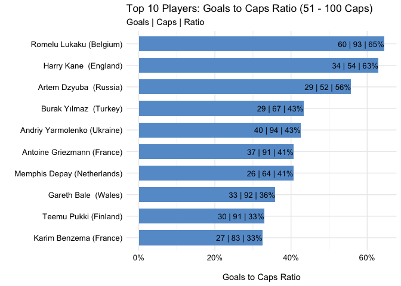<!-- -->

``` r
# Goals to caps plot: above 100 caps
goals_caps_tbl %>% 
    filter(caps_bin == "Above 100 caps") %>% 
    func_plot_goal_cap_ratio() %>% 
    func_plot_bar_chart(x_var = goal_to_cap_ratio, y_var = player_country, label_var = label_text)+
    scale_x_continuous(labels = scales::percent_format(accuracy = 1))+
    labs(title = "Top 10 Players: Goals to Caps Ratio (Above 100 caps)", subtitle = "Goals | Caps | Ratio",
         x = "\nGoals to Caps Ratio", y = "")
```

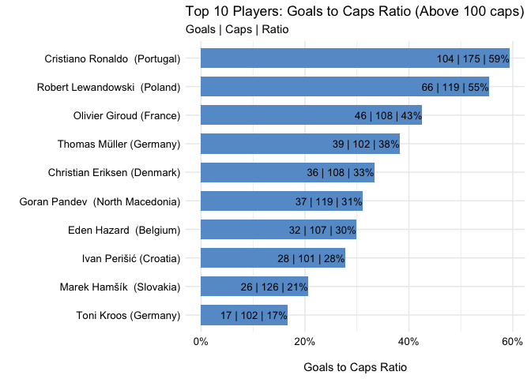<!-- -->

------------------------------------------------------------------------

### **Who are the oldest and youngest players in the tournament?**

``` r
final_euros_tbl %>% 
    arrange(desc(age)) %>% 
    slice_max(order_by = age, n = 10) %>% 
    mutate(player_country = player_country %>% fct_reorder(age)) %>% 
    func_plot_bar_chart(x_var = age, y_var = player_country, label_var = age)+
    labs(title = "10 Oldest Players", x = "\nAge", y = "",
         caption = "More than 10 value returned when multiple players share the same age")
```

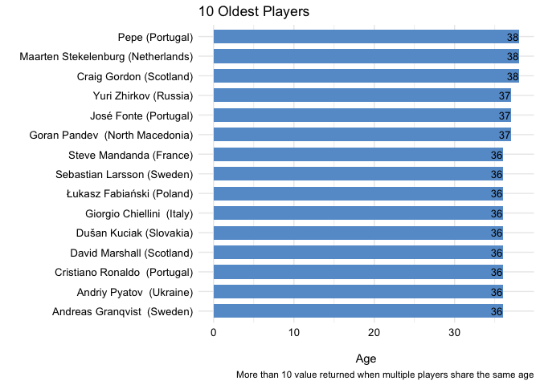<!-- -->

``` r
final_euros_tbl %>% 
    arrange(age) %>% 
    slice_min(order_by = age, n = 10) %>% 
    mutate(player_country = player_country %>% fct_reorder(age)) %>% 
    func_plot_bar_chart(x_var = age, y_var = player_country, label_var = age)+
    labs(title = "10 Youngest Players", x = "\nAge", y = "",
         caption = "More than 10 value returned when multiple players share the same age")
```

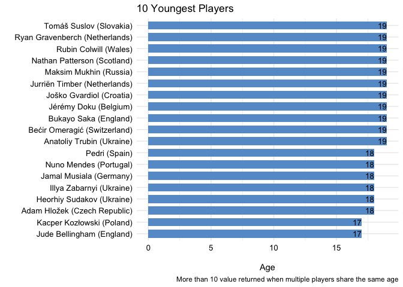<!-- -->

------------------------------------------------------------------------

### **What is the age distribution of players like?**

``` r
# Age distribution (all)
p1 <- final_euros_tbl %>% 
    ggplot(aes(age))+
    geom_boxplot(fill = "#669cd1")+
    theme_minimal()+
    labs(title = "Age Distribution",
         subtitle = str_glue("Min Age: {min(final_euros_tbl$age)} | Average Age: {round(mean(final_euros_tbl$age),0)} | Max Age: {max(final_euros_tbl$age)}"))

# Age distribution by position
p2 <- final_euros_tbl %>% 
    ggplot(aes(age))+
    geom_boxplot(fill = "#669cd1")+
    theme_minimal()+
    facet_wrap(~ position)+
    labs(title = "Age Distribution by Position", x = "Age")

p1 / p2
```

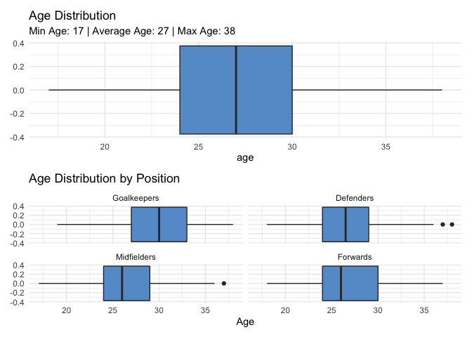<!-- -->

------------------------------------------------------------------------

### **What clubs are most represented at the tournament?**

``` r
final_euros_tbl %>% 
    group_by(club) %>% 
    count() %>% 
    arrange(desc(n)) %>% 
    ungroup() %>% 
    slice(1:10) %>% 
    mutate(club = club %>% fct_reorder(n)) %>% 
    func_plot_bar_chart(x_var = n, y_var = club, label_var = n)+
    labs(title = "Top 10 Clubs Represented", x = "No. of Players", y = "")
```

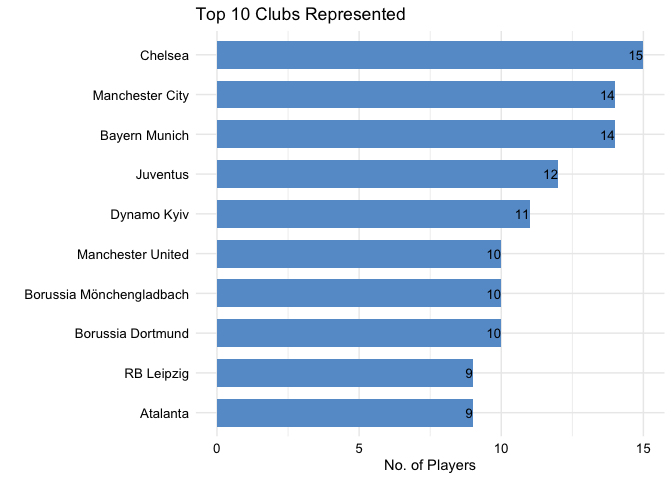<!-- -->

------------------------------------------------------------------------

### **What Countries have the most players at a single club?**

``` r
final_euros_tbl %>% 
    group_by(country, club) %>% 
    count() %>% 
    arrange(desc(n)) %>% 
    ungroup() %>% 
    filter(n >= 5) %>% 
    mutate(country_club = str_glue("{country} ({club})")) %>% 
    mutate(country_club = country_club %>% fct_reorder(n)) %>%  
    func_plot_bar_chart(x_var = n, y_var = country_club, label_var = n)+
    labs(title = "Countries With the Most Players at a Single Club", x = "No of Players", y = "")
```

<!-- -->

–

## **Wrapping Up**

In this project, I scrapped Euro 2021 data from
[wikipedia](https://en.wikipedia.org/wiki/UEFA_Euro_2020_squads), then
proceeded to answer some questions around player stats, using bar charts
and boxplots to visualize the data.
